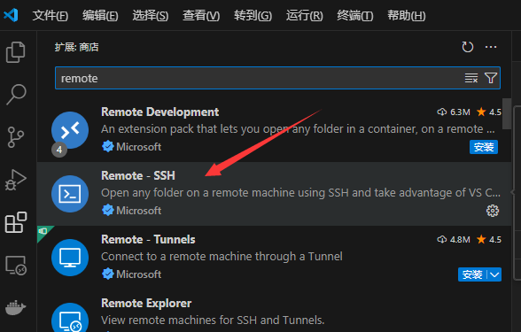
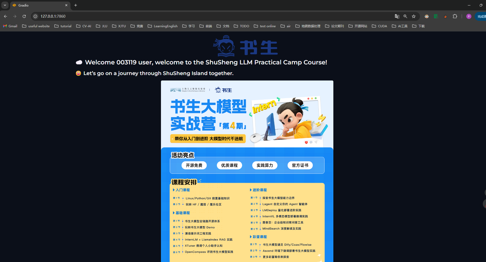

## Linux闯关

任务地址: https://github.com/InternLM/Tutorial/tree/camp4/docs/L0/linux

这一章节主要是配置开发环境，包括

- 连接远程服务器
- 端口映射
- 配置python环境

### 连接远程服务器

实战营的InternStudio平台为我们提供了个人开发机，且分配了GPU, 可以通过算力点购买，具体步骤如下

进入InternStudio网址： https://studio.intern-ai.org.cn/console/dashboard

创建开发机， 选择镜像，选择GPU配置，运行时间

可能需要等待一定时间排队才能完成创建

创建完成后显示如下

#### web端连接

可以在web端进入开发机进行操作

点击操作栏的进入开发机， 左上角可以选择三种开发模式，分别为Notebook(交互式), Terminal(终端), VSCode(ide), 

##### Notebook界面


可以在目录创建一个Notebook进行简单的尝试, 例如: 输出python版本

```jupyter-notebook
!python3 --version
>>> Python 3.8.10

import sys
print(sys.version)
>>> 3.8.10 (default, May 26 2023, 14:05:08) 
[GCC 9.4.0]
```

##### Terminal界面


此时进入的就是linux终端界面,可以输入指令`studio-smi`查看资源使用情况

##### vscode界面


也就是我们熟悉的vscode界面,可以编辑调试代码, 也可以新建终端

#### SSH连接

如果web端连接感觉不熟悉,可以使用本地PCssh连接远程主机,使远程的环境可以在本地跑

##### 终端

在控制台找到ssh连接


复制登录命令, 打开本地PC的powershell, 输入该登录命令, 回车,此时会显示输入密码的命令,返回网站复制密码,在终端中单击鼠标右键即可完成粘贴,回车进行连接


此时的终端已经连接到了远程服务器,可以在此终端中对远程服务器操作

##### VSCode

vscode需要下载插件->remote-SSH



点击右侧边栏远程资源管理器对SSH进行设置


选择要更新的SSH配置文件->`C:\Users\用户名\.ssh\config`, 添加以下内容

```config
# 该连接的名字,可以任意指定
Host InternStudio
  # 主机名
  HostName ssh.intern-ai.org.cn
  # 端口号
  Port 38240 
  # 连接用户
  User root
  # 表示禁用严格的主机密钥检查。这意味着当连接到一个新的 SSH 服务器时，不会严格验证服务器的主机密钥，可能会带来一定的安全风险。
  StrictHostKeyChecking no 
  # 则是将用户已知的主机密钥文件设置为 /dev/null ，这实质上是忽略了对已知主机密钥的记录和使用。
  UserKnownHostsFile /dev/null
```

之后远程资源管理器ssh下方会多出一个名为`InternStudio`的连接, 点击即可连接远程服务器


### 端口映射

端口映射说白了就是希望远程服务器的某个端口的服务或者应用在本地机器也可以访问到, 比如远程机器的3680端口的http服务, 可以在远程服务器本地回环127.0.0.1:7860进行访问, 如果希望在本地也可以访问到,就需要进行端口映射, 通过ssh隧道将远程的7860服务映射到本地的7860端口上,也就是让本地7860监听远程7860端口的数据, 在本地访问127.0.0.1:7860时,会自动获取远程主机7860端口的数据

更详细的介绍可以具体可以参考任务点教程 https://github.com/InternLM/Tutorial/tree/camp4/docs/L0/linux#23-%E7%AB%AF%E5%8F%A3%E6%98%A0%E5%B0%84

ssh实现端口映射命令

```shell
ssh -p 38240 root@ssh.intern-ai.org.cn -CNg -L {本地机器_PORT}:127.0.0.1:{开发机_PORT} -o StrictHostKeyChecking=no
```

其中即可完成本地机器_PORT到开发机_PORT的端口映射

比如, 我们在终端输入

```shell
ssh -p 38240 EMAIL -CNg -L 7860:127.0.0.1:7860 -o StrictHostKeyChecking=no
```


此时终端没有任何输出,表示已经完成端口映射, 此时在本地浏览器输入`127.0.0.1:7860`即可访问到远程服务器的7860端口的服务

我们可以用一个例子来证明是端口映射是否成功

在远程机创建一个hello_world.py文件, 这是一个web demo

```python
import socket
import re
import gradio as gr
 
# 获取主机名
def get_hostname():
    hostname = socket.gethostname()
    match = re.search(r'-(\d+)$', hostname)
    name = match.group(1)
    
    return name
 
# 创建 Gradio 界面
with gr.Blocks(gr.themes.Soft()) as demo:
    html_code = f"""
            <p align="center">
            <a href="https://intern-ai.org.cn/home">
                
            </a>
            </p>
            <h1 style="text-align: center;">☁️ Welcome {get_hostname()} user, welcome to the ShuSheng LLM Practical Camp Course!</h1>
            <h2 style="text-align: center;">😀 Let’s go on a journey through ShuSheng Island together.</h2>
            <p align="center">
                <a href="https://github.com/InternLM/Tutorial/blob/camp3">
                    
                </a>
            </p>

            """
    gr.Markdown(html_code)

demo.launch()
```

在服务器终端安装必要的依赖包

```shell
pip install gradio==4.29.0
```

之后可以运行该web项目

```Python
python hello_world.py
```


之后在本地浏览器输入`127.0.0.1:7860`即可访问到远程服务器的7860端口的服务,效果如下



### Linux基础指令

在 Linux 中，常见的文件管理操作包括：

- **创建文件**：可以使用 `touch` 命令创建空文件。
- **创建目录**：使用 `mkdir` 命令。
- **目录切换**：使用`cd`命令。
- **显示所在目录**：使用`pwd`命令。
- **查看文件内容**：如使用 `cat` 直接显示文件全部内容，`more` 和 `less` 可以分页查看。
- **编辑文件**：如 `vi` 或 `vim` 等编辑器。
- **复制文件**：用 `cp` 命令。
- **创建文件链接**：用`ln`命令。
- **移动文件**：通过 `mv` 命令。
- **删除文件**：使用 `rm` 命令。
- **删除目录**：`rmdir`（只能删除空目录）或 `rm -r`（可删除非空目录）。
- **查找文件**：可以用 `find` 命令。
- **查看文件或目录的详细信息**：使用`ls`命令，如使用 `ls -l`查看目录下文件的详细信息。
- **处理文件**：进行复杂的文件操作，可以使用`sed`命令。

#### find

`find`命令是Linux系统中一个强大的文件搜索工具，它可以在指定的目录及其子目录中查找符合条件的文件或目录，并执行相应的操作。

以下是`find`命令的一些常见用法：

1. **按文件名查找**：使用`-name`选项按照文件名查找文件。例如，`find /path/to/directory -name "file.txt"`将在指定目录及其子目录中查找名为`file.txt`的文件。
2. **按文件类型查找**：使用`-type`选项按照文件类型查找文件。例如，`find /path/to/directory -type f`将查找指定目录及其子目录中的所有普通文件。
3. **按文件大小查找**：使用`-size`选项按照文件大小查找文件。例如，`find /path/to/directory -size +100M`将查找指定目录及其子目录中大于100MB的文件。
4. **按修改时间查找**：使用`-mtime`、`-atime`或`-ctime`选项按照文件的修改时间、访问时间或状态更改时间查找文件。例如，`find /path/to/directory -mtime -7`将查找指定目录及其子目录中在7天内修改过的文件。
5. **按文件权限查找**：使用`-perm`选项按照文件权限查找文件。例如，`find /path/to/directory -perm 755`将查找指定目录及其子目录中权限为755的文件。
6. **按用户或组查找**：使用`-user`或`-group`选项按照文件的所有者或所属组查找文件。例如，`find /path/to/directory -user username`将查找指定目录及其子目录中属于用户`username`的文件。
7. **执行操作**：使用`-exec`选项可以对找到的文件执行相应的操作。例如，`find /path/to/directory -name "*.txt" -exec rm {} \;`将删除找到的所有以`.txt`结尾的文件。

#### 文本处理

`sed`命令是一种流编辑器，主要用于文本处理，在处理复杂的文件操作时经常用到，在后续的课程中会使用到，`sed`命令常用参数及使用示例如下：

- **参数说明：**
  - `-e<script>` 或 `--expression=<script>`：直接在命令行中指定脚本进行文本处理。
  - `-f<script文件>` 或 `--file=<script文件>`：从指定的脚本文件中读取脚本进行文本处理。
  - `-n` 或 `--quiet` 或 `--silent`：仅打印经过脚本处理后的输出结果，不打印未匹配的行。
- **动作说明：**
  - `a`：在当前行的下一行添加指定的文本字符串。
  - `c`：用指定的文本字符串替换指定范围内的行。
  - `d`：删除指定的行。
  - `i`：在当前行的上一行添加指定的文本字符串。
  - `p`：打印经过选择的行。通常与 `-n` 参数一起使用，只打印匹配的行。
  - `s`：使用正则表达式进行文本替换。例如，`s/old/new/g` 将所有 "InternLM" 替换为 "InternLM yyds"。

在示例中使用了`echo`命令，这和python中的`print`一样，用来打印内容，这里使用管道符`>`将InternLM打印到file文件中，常用的管道符还有`<`和`|`，比如我们可以使用`grep`命令来查看python中安装的包含`os`字段的包：

```shell
pip list | grep os
```

`grep`是一个强大的文本搜索工具。常用参数如下：

- `-i`：忽略大小写进行搜索。
- `-v`：反转匹配，即显示不匹配的行。
- `-n`：显示行号。
- `-c`：统计匹配的行数。

#### 进程管理

**进程管理**命令是进行系统监控和进程管理时的重要工具，常用的进程管理命令有以下几种：

- **ps**：查看正在运行的进程
- **top**：动态显示正在运行的进程
- **pstree**：树状查看正在运行的进程
- **pgrep**：用于查找进程
- **nice**：更改进程的优先级
- **jobs**：显示进程的相关信息
- **bg 和 fg**：将进程调入后台
- **kill**：杀死进程

#### 常用工具

这里介绍一个工具`TMUX`，`TMUX` 是一个终端多路复用器。它可以在多个终端之间轻松切换，分离它们（这不会杀死终端，它们继续在后台运行）和将它们重新连接到其他终端中。为什么要介绍这个工具呢？因为在后面进行`Xtuner`微调模型的时候，时间会很长，使用`Tmux`可以解决程序被杀死中断的情况，

使用`apt install tmux`命令安装tmux，安装完成以后可以使用`tmux`命令就可以使用tmux了，如果想退出tmux可以使用“**Ctrl+d**”快捷键。

> 开发机仅 /root 路径下的文件是持久化存储的，其他路径下安装的软件重启后都会被重置。

具体的使用方法可以查看：

https://www.ruanyifeng.com/blog/2019/10/tmux.html