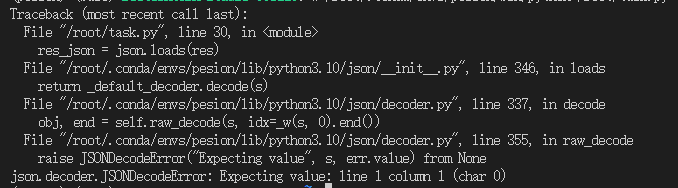

### Leetcode 383 赎金信

给你两个字符串：ransomNote 和 magazine ，判断 ransomNote 能不能由 magazine 里面的字符构成。

如果可以，返回 true ；否则返回 false 。

magazine 中的每个字符只能在 ransomNote 中使用一次。

字典， 创建字典，保存magazine中的字符与出现次数，然后遍历ransomNote， 如果ransomNote中的字符在字典中出现，就将字典中的字符出现次数减一，如果ransomNote中的字符在字典中没有出现，就返回False，如果ransomNote中的字符在字典中出现次数为0，就返回False，最后返回True, 由于ransomNote 和 magazine 由小写英文字母组成, 所以也可以通过大小为26的数组代替字典

```python
class Solution(object):
    def canConstruct(self, ransomNote, magazine):
        """
        :type ransomNote: str
        :type magazine: str
        :rtype: bool
        """
        mp = {}
        # 保存magazine中的字符与出现次数
        for i in magazine:
            if mp.get(i, 0)==0:
                mp.setdefault(i, 1)
            else:
                mp[i]+=1
        # 遍历ransomNote
        for i in ransomNote:
            # 如果ransomNote中的字符在字典中没有出现，或者为0，就返回False
            if mp.get(i,0)==0:
                return False
            # 将字典中的字符出现次数减一
            mp[i]-=1
        return True 
```


### 任务二

首先在服务器创建一个自己的环境安装相关依赖

```shell
conda create -n pesion python==3.10
```

之后进入环境安装openai

```shell
conda activate pesion
pip install openai
```

创建一个python文件, 代码如下

```Python
from openai import OpenAI
import json
def internlm_gen(prompt,client):
    '''
    LLM生成函数
    Param prompt: prompt string
    Param client: OpenAI client 
    '''
    response = client.chat.completions.create(
        model="internlm2.5-latest",
        messages=[
            {"role": "user", "content": prompt},
      ],
        stream=False
    )
    return response.choices[0].message.content

api_key = ''
client = OpenAI(base_url="https://internlm-chat.intern-ai.org.cn/puyu/api/v1/",api_key=api_key)

content = """
书生浦语InternLM2.5是上海人工智能实验室于2024年7月推出的新一代大语言模型，提供1.8B、7B和20B三种参数版本，以适应不同需求。
该模型在复杂场景下的推理能力得到全面增强，支持1M超长上下文，能自主进行互联网搜索并整合信息。
"""
prompt = f"""
请帮我从以下``内的这段模型介绍文字中提取关于该模型的信息，要求包含模型名字、开发机构、提供参数版本、上下文长度四个内容，以json格式返回。
`{content}`
"""
res = internlm_gen(prompt,client)
res_json = json.loads(res)
print(res_json)
```

其中我们需要api_key进行调用模型推理, api申请网址在 https://internlm.intern-ai.org.cn/api/tokens

在vscode中进行调试



可以看到是 `res_json = json.loads(res)`语句报错, 在此语句打断点后, 将res变量进行输出查看


可以看到res的字段是markdown格式的, 其中json字段被` ```json `和` ``` `包裹起来了,所以导致无法解析json, 我们需要将res中的` ```json `和` ``` `去除, 代码如下:

```python
res = res.replace('```json','').replace('```','')
```

所以更改后的代码为

```Python
from openai import OpenAI
import json
def internlm_gen(prompt,client):
    '''
    LLM生成函数
    Param prompt: prompt string
    Param client: OpenAI client 
    '''
    response = client.chat.completions.create(
        model="internlm2.5-latest",
        messages=[
            {"role": "user", "content": prompt},
      ],
        stream=False
    )
    return response.choices[0].message.content

api_key = '' # 填写自己的api_key
client = OpenAI(base_url="https://internlm-chat.intern-ai.org.cn/puyu/api/v1/",api_key=api_key)

content = """
书生浦语InternLM2.5是上海人工智能实验室于2024年7月推出的新一代大语言模型，提供1.8B、7B和20B三种参数版本，以适应不同需求。
该模型在复杂场景下的推理能力得到全面增强，支持1M超长上下文，能自主进行互联网搜索并整合信息。
"""
prompt = f"""
请帮我从以下``内的这段模型介绍文字中提取关于该模型的信息，要求包含模型名字、开发机构、提供参数版本、上下文长度四个内容，以json格式返回。
`{content}`
"""
res = internlm_gen(prompt,client)
res_json = json.loads(res.replace('```json', '').replace('```',''))
print(res_json)
```

输出结果为

```
{'model_name': '书生浦语InternLM2.5', 'developer': '上海人工智能实验室', 'parameter_versions': ['1.8B', '7B', '20B'], 'context_length': '1M'}
```


