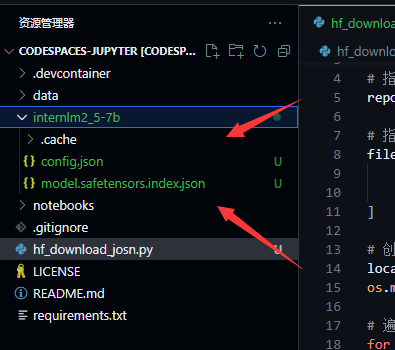
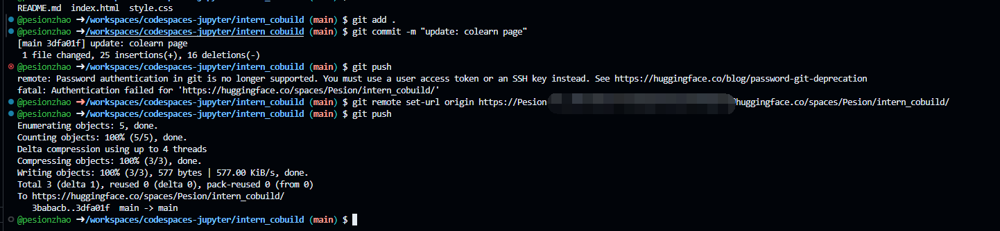

### 下载模型

InternLM模型地址: https://huggingface.co/internlm/internlm2_5-1_8b

在此网址下可以看到InternLM模型文件以及实例代码等

由于网络和磁盘的原因，我们在CodeSpace上进行实验

https://github.com/codespaces

选择Jupyter Notebook, 出现vscode页面

在终端中安装相关依赖

```shell
pip install transformers==4.38
pip install sentencepiece==0.1.99
pip install einops==0.8.0
pip install protobuf==5.27.2
pip install accelerate==0.33.0
```

之后创建一个python文件,用来下载特定模型文件

```shell
touch hf_download_josn.py
```

在这个文件中粘贴以下代码

```python
import os
from huggingface_hub import hf_hub_download

# 指定模型标识符
repo_id = "internlm/internlm2_5-7b"

# 指定要下载的文件列表
files_to_download = [
    {"filename": "config.json"},
    {"filename": "model.safetensors.index.json"}
]

# 创建一个目录来存放下载的文件
local_dir = f"{repo_id.split('/')[1]}"
os.makedirs(local_dir, exist_ok=True)

# 遍历文件列表并下载每个文件
for file_info in files_to_download:
    file_path = hf_hub_download(
        repo_id=repo_id,
        filename=file_info["filename"],
        local_dir=local_dir
    )
    print(f"{file_info['filename']} file downloaded to: {file_path}")
```

之后在终端中运行该文件

```shell
python hf_download_josn.py
```

完成后可以看到目录下多了`config.json` 和 `model.safetensors.index.json`文件



### 上传文件

在hugging face 的space中创建一个新的space, 名字为intern_cobuild: https://huggingface.co/spaces

接着回到codespace中克隆该项目

```shell
cd /workspaces/codespaces-jupyter
git clone https://huggingface.co/spaces/Pesion/intern_cobuild
cd /workspaces/codespaces-jupyter/intern_cobuild
```


接着进入该目录,修改index.html文件, push到远程分支即可

```
git add .
git commit -m "update: colearn page"
git push
```

此时无法push, 是因为没有申请token, 获取token的方法如下: 在hugging face的个人设置中, 点击 `Access Tokens` 按钮, 然后点击 `New Token` 按钮, 输入token的名称, 选择 `write` 权限, 点击 `Create Token` 按钮, 即可获取token, 按照如下格式进行绑定

```
git remote set-url origin https://<user_name>:<token>@huggingface.co/<repo_path>
```
之后就可以成功push

