## 书生·浦语大模型开源开放体系笔记

### 概述

书生浦语大模型性能天梯，在今年InternLM2.5-7B-Chat性能已经与ChatGPT4达到齐平

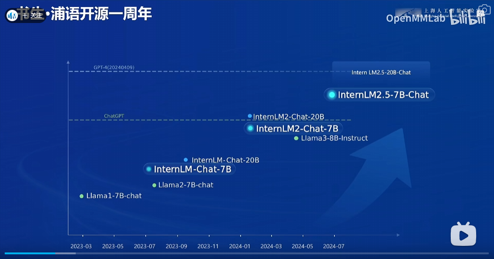

InternLM2.5的主要优势有以下几点

- 推理能力的领先
- 对上下文的记忆能力
- 具有自主规划和搜索的能力

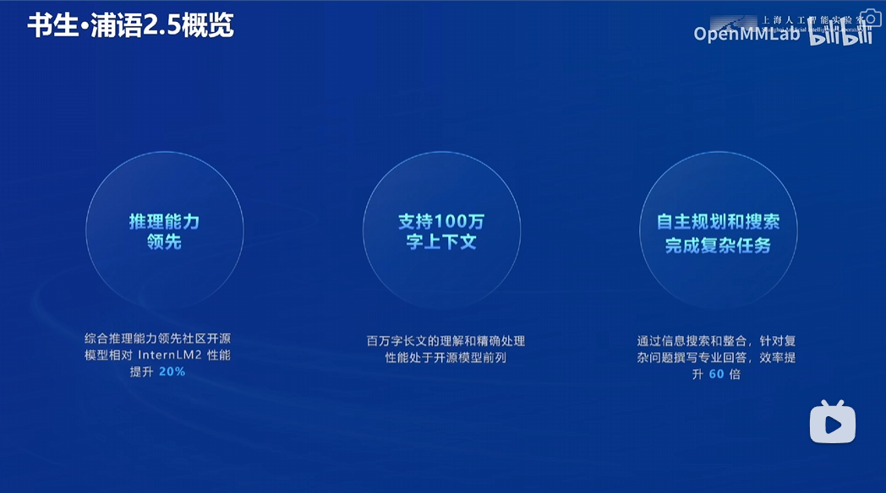

### 核心技术思路以及全链路工具

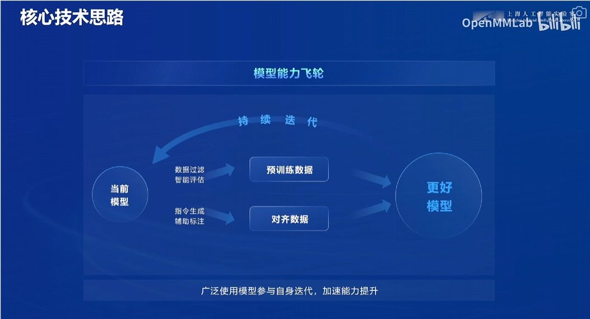

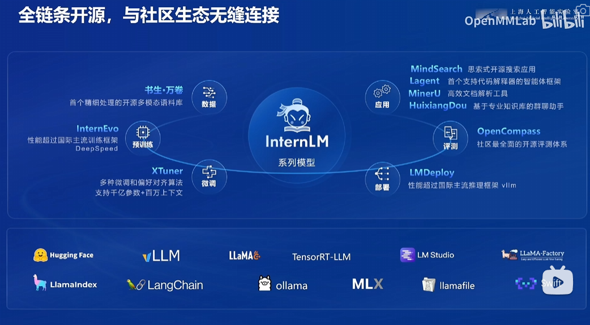

### 数据

书生·万卷（WanJuan） 是一个多模态语料库，它包含了超过2TB的数据，覆盖文本、图文和视频数据集。这个语料库由上海人工智能实验室联合多家机构共同开源发布，旨在为学术界及产业界提供高质量、符合主流中文价值对齐的大模型多模态预训练语料。它具有以下特点：

- **多元融合**：包含文本、图文、视频等多模态数据，覆盖科技、文学、媒体、教育、法律等多个领域。
- **精细处理**：经过语言甄别、正文抽取、格式标准化、数据过滤与清洗、多尺度去重、数据质量评估等精细化数据处理环节。
- **价值对齐**：内容与中文主流价值观对齐，通过算法与人工评估结合的方式提升语料的纯净度。
- **易用高效**：采用统一格式，并提供详细的字段说明和工具指导，兼顾易用性和效率。

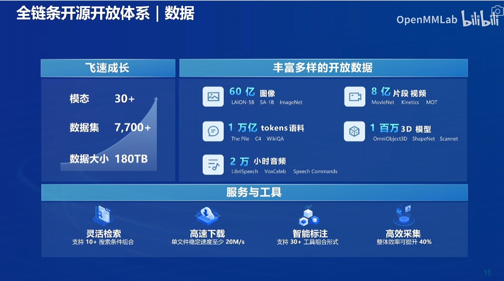

### 开源工具箱

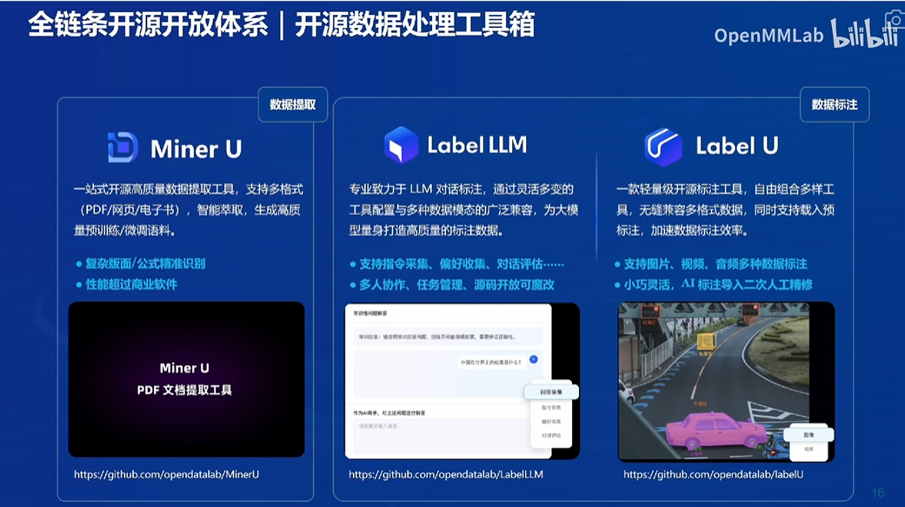

### 预训练

**InternEvo** 是一个开源的轻量级训练框架，支持大规模模型预训练和微调。它具有以下优势：

- **高性能**：在1024个GPU上进行训练时，InternEvo可实现近90%的加速效率。
- **灵活性**：支持在具有上千GPU的大规模集群上进行预训练，并在单个GPU上进行微调。
- **兼容性**：兼容主流的Hugging Face技术生态，便于模型的迁移和应用。
- 
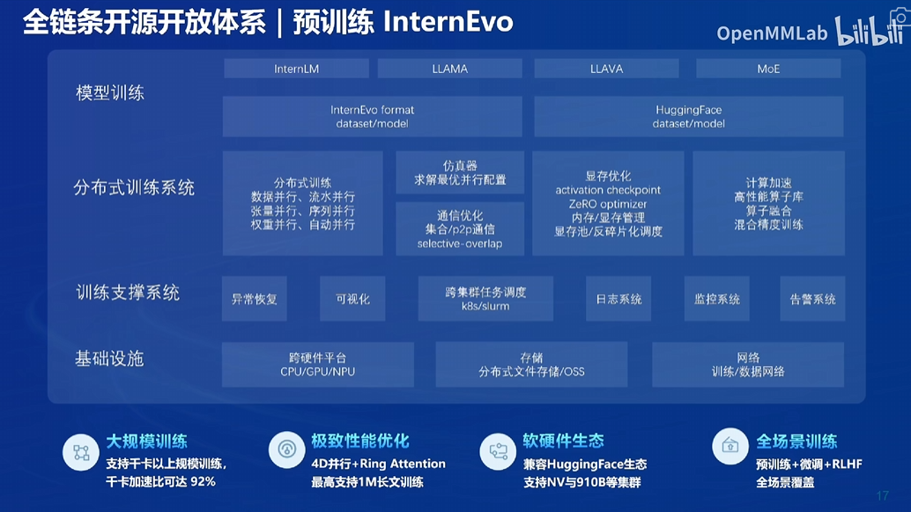

### 微调

**XTuner** 是一个高效微调LLMs的工具箱，它支持多种模型和微调算法，具有以下特性：

- **多种微调算法**：支持QLoRA、LoRA、全量参数微调等多种微调算法。
- **数据集支持**：兼容多种数据集格式，并提供多种训练引擎结合的可能性。
- **高效训练**：自动分发高性能算子以加速训练吞吐，兼容DeepSpeed，轻松应用各种ZeRO训练优化策略。

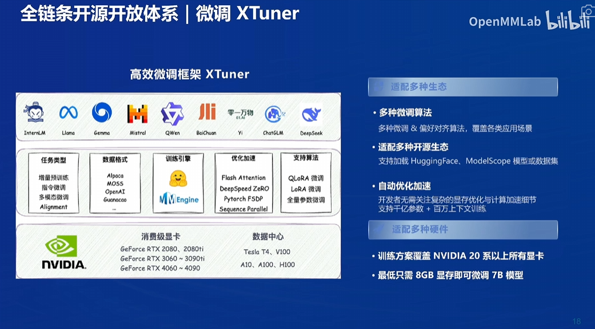

### 评测体系

OpenCompass（司南）是由上海人工智能实验室发布的开源大模型评测体系，提供一站式的评估平台，支持大语言模型和多模态模型的评测。它具有以下特点：

- **全面的能力维度：** 覆盖知识、语言、理解、推理、考试等5大能力维度，整合超过70个评测数据集，提供超过40万个模型评测问题。
- **丰富模型支持：** 支持超过70种开源模型评测，包括HuggingFace和API模型，支持OpenAI接口调用。
- **分布式高效评测：** 支持本机或集群上的计算任务并行分发，实现评测并行式的提速。
- **多样化评测方式：** 提供零样本评测、小样本评测和思维链评测等多样化评测方法。
- **灵活化拓展：** 支持灵活便捷的添加评测数据集与模型，用户可通过预留接口对非开源的自定义模型进行评测。
- **开源可复现：** 所有支持的数据集及各数据集多版本提示词，用户可一键下载，确保评测结果可以被完整复现。

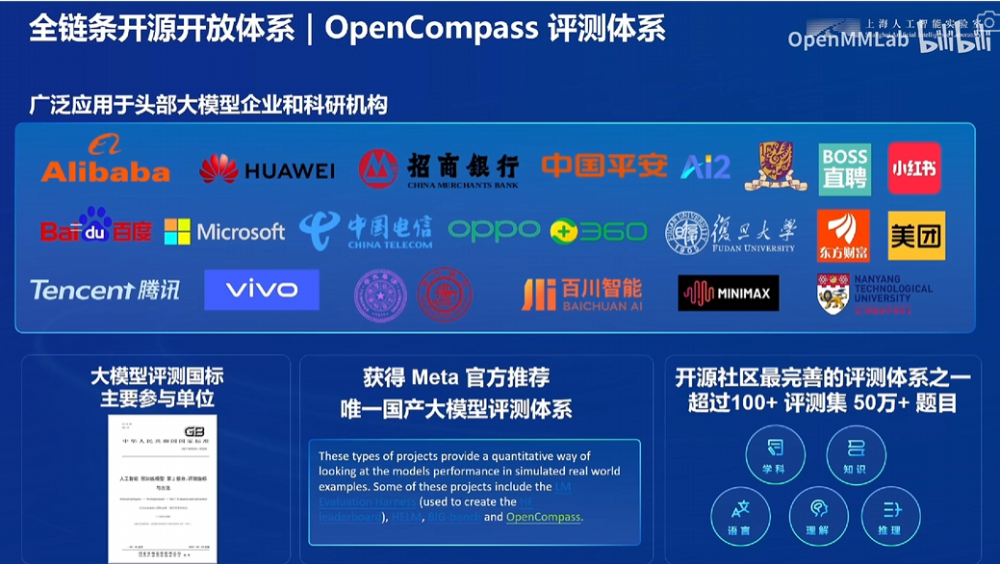

### 部署

**LMDeploy** 是一个高效且友好的LLMs模型部署工具箱，功能涵盖了量化、推理和服务。具有以下特点：

- **高效推理引擎**：具有TurboMind推理引擎，提供交互式推理模式和量化支持。它支持权重量化和k/v量化，提供Persistent Batch、Blocked K/V Cache、动态拆分和融合、张量并行等特性。LMDeploy支持多模型在多机、多卡上的推理服务，具有卓越的兼容性。
- **部署便捷**：简化了模型从训练到部署的过程，提高了模型服务的效率。用户可以通过简单的几行代码或命令完成LLM模型和VLM模型的离线推理，搭建与OpenAI接口兼容的模型服务，并通过控制台命令行与LLM模型进行交互式聊天。

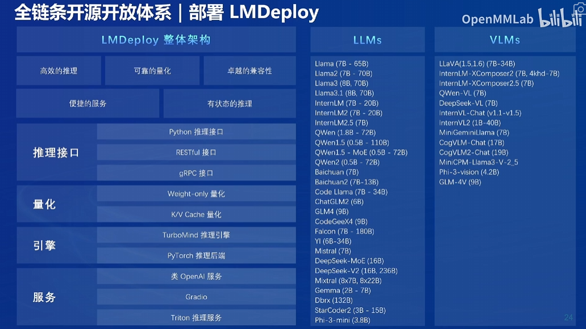

### 智能体

- **Lagent** 是一个轻量级框架，允许用户高效构建基于LLM的代理，简化开发流程并提高效率。它提供了一套LLM驱动的智能体用来与真实世界交互并执行复杂任务的函数。
- **MindSearch** 是一个用于构建智能体的框架，它主要结合了自然语言处理和知识管理功能，帮助开发者创建能够理解和执行复杂指令的智能系统
- 
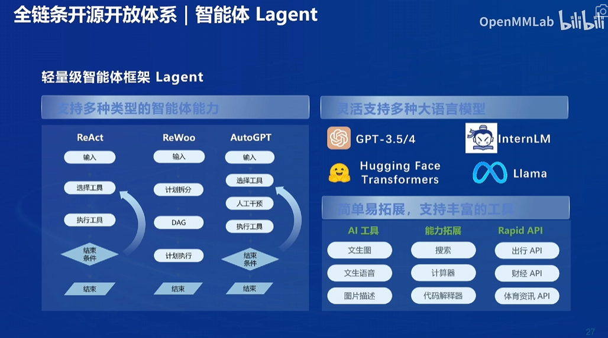

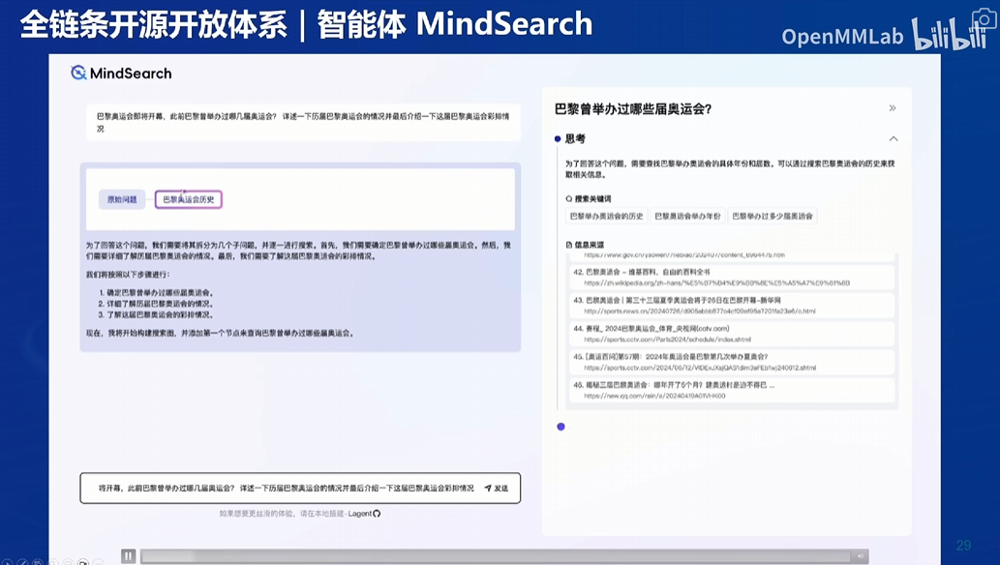