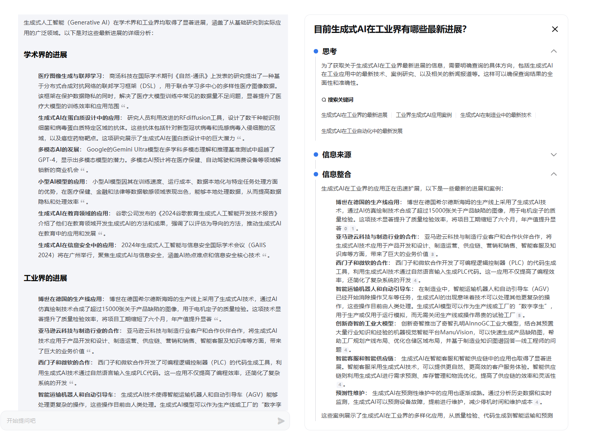
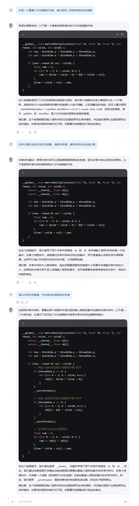
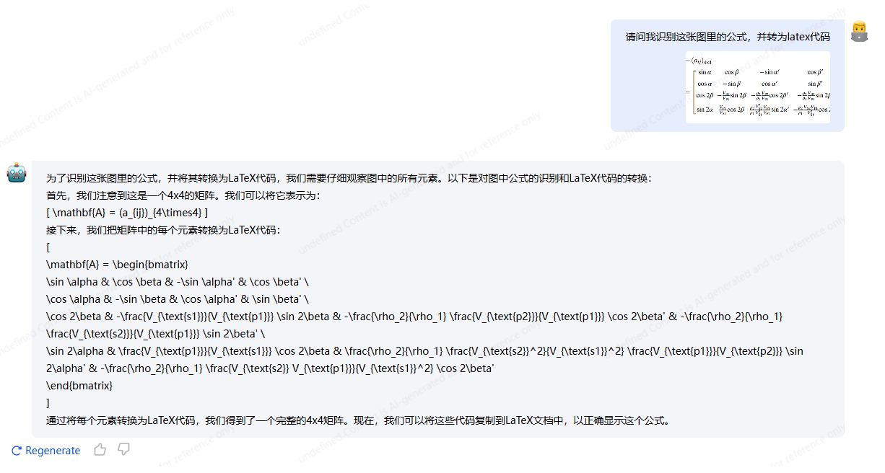

### [MindSearch](https://internlm-chat.intern-ai.org.cn/suggestion/oVmlpR34V9U6v9KBQ1TN7IpPQh1Z89ONciSGUKmgFFA=): 开源的 AI 搜索引擎

目前生成式AI在学术和工业界有什么最新进展？

左边栏为MindSearch的思考过程，右边栏为解答结果。

### [书生·浦语](https://internlm-chat.intern-ai.org.cn/) InternLM 开源模型官方的对话类产品

我们使用该产品进行简单代码设计的测试 

可以看出在提示词给出逻辑时，大模型还是能给出不错的答案

### [书生·万象](https://internvl.opengvlab.com/) InternVL 开源的视觉语言模型官方的对话产品

我们使用该产品进行图像公式的识别任务

可以看出大模型准确给出了其正确的公式
